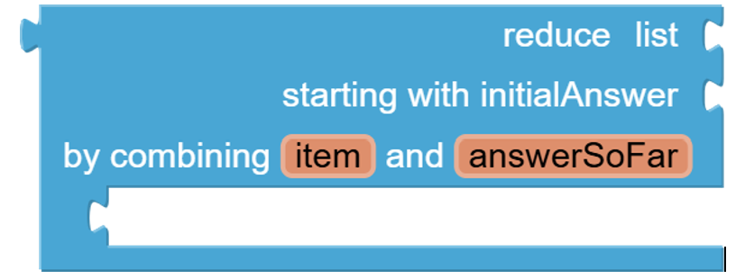
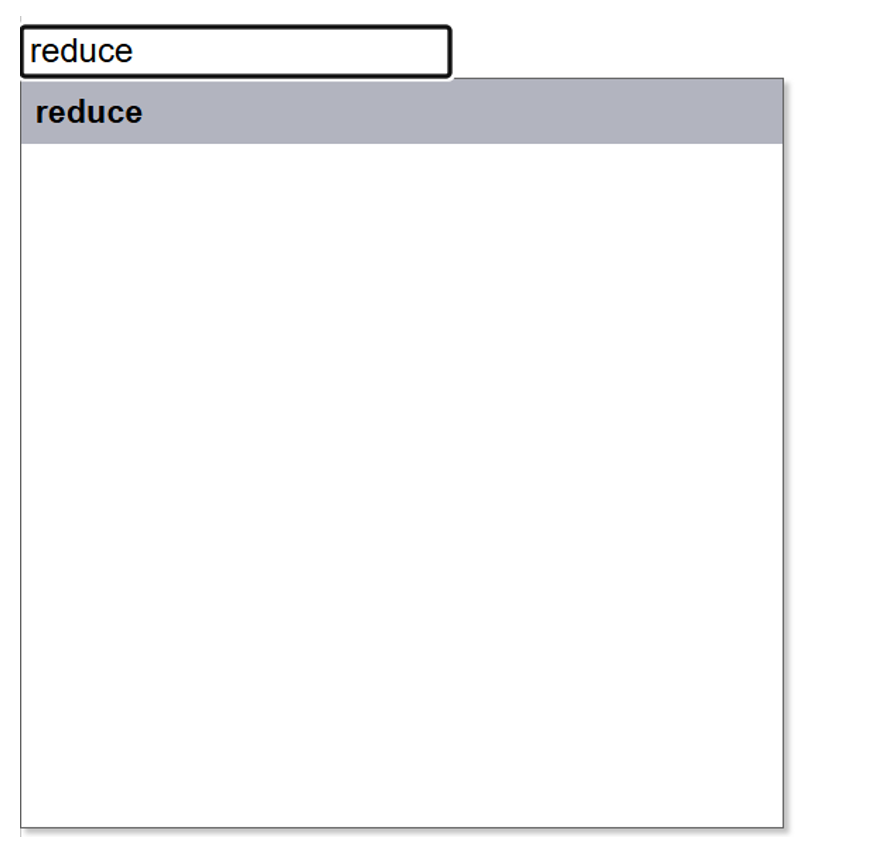

### *Computer Club Newsletter - Article 01 by 3D Isaac Cheung*
# __Things you did not learn in CL lessons__

### Introduction
We’ve all seen it – we’ve all heard it – sometimes, CL lessons may feel like a pain. Usually, it’s because most of our learning paces vary, resulting in some of us not being able to catch up. Yet, the pioneering industrial engineer Allen F. Morgenstern once proclaimed the following resonating saying,
Work smarter, not harder.
Many times when we encounter obstacles, the root cause may not be our inherent, incurable ignorance, but our lack of guidance on how to take a shortcut in the path of knowledge. This volume of newsletter would hope to enrich our experience through introducing a series of tips that could very well be the breaker of the boundaries restricting your comprehension in Computer Literacy.

### **Scratch**
*Using Scratch to apply special effects to pictures*

From [1], Scratch might be a convenient way to apply special effects<sup>1</sup>  (e.g. Pixelation, Colouration etc.), because of its wide variety of blocks in the ```Looks``` category.
To achieve this purpose, one must utilise images as ```Sprites```, then apply the desired effect:
I.	Firstly, select an image of your choosing (in this case, an adorable mouse).
 


II.	Then, execute the following commands to apply the effect on the image:
(Note: *color* and the number value can be altered to achieve different results.)


III.	On your result window, the image should now appear as follows:
(Again, results may vary depending on the effect and value you have chosen.)


 
IV.	Simply screenshot the image and use it wherever you want. As you can see, we have successfully transformed the mouse into a plague mouse for a scientific investigation.


###### <sup>1</sup> 3D (05) Lam Ho Ching; a credible source; Committee member of Computer Club

### **MIT App Inventor**
*Instant block search in App Inventor*

Have you ever been frustrated about <span style="color:green">getting lost in the vast ocean of blocks in App Inventor, whilst unable to find the code that you wish for</span> ? Unbeknownst to some, the platform actually has a built-in feature to deal with this daily inconvenience.
Let’s say that you are searching for the block: 



If you’re not proficient enough in app inventor to even know what this is, let alone find it, searching for the component may prove to be a near-impossible and perilous journey. That is when we can use the block search feature:



By simply typing on your keyboard, a <span style="color:cyan">pop-up window</span> will appear on the top left of the screen. Then, click the block you wish to use (in this case the bolded words **“reduce”**), and it will instantly apparate onto your canvas. Magical, isn’t it?
In app inventor where millions of blocks exist for each unique component, trying to memorise the location for every one of them may be futile. With this new feature acknowledge, you’re sure to <span style="color:orange">work your way through code quickly and never lose track of codes again</span>.

### **Python**
*For educational purposes only – Internet forums*

We all know the most frustrating part of Python – knowing what to do, but not knowing how. You could spend hours trying to type some specific lines of codes but in vain as you get progressively and progressively more annoyed until you seem like you’re going to explode into smithereens. But before you reach out to your local "hokba" for help, consider seeking help from your most trustworthy buddy yet – Google. In there lives an <span style="color:green">active community of people who’ve been through your troubles</span> before and painfully solved them by hand. Though they were generous enough to publish their findings so that you don’t have to go through the same kind of suffering. Let me show you an example:
```
string = "Python is"
```
Assume Bob is a student working on his CL assignment of printing a complete sentence. He firstly uses the above string as a base;
```
# Adding the rest of the sentence

string.append("good")
```
He then tries to append the rest of the string.
```
Attribute Error: 'str' object has no attribute 'append'
```
However, an annoying error appears. Now, we can try to seek the help of the Internet:
> If you want to append a value to ```myList```, use ```myList.append(s)```. Strings are immutable -- you can't appent to them.
>
A helpful stranger clarifies that a string is immutable, meaning they cannot be appended to. Hence, we should simply use a list:
 ```
 string = ["Python is"]

 #Adding the rest of the sentence

 string.append("good")
 print("".join(string))

 ```
<span style="color:green">Problem solved!</span>

Many more difficult and advanced questions can be solved by some insight by others. Remember that the Internet is not a place of desolation where everything you search up is too difficult to understand, but an oasis where many answers can be found with just a bit of inquiry. Ten thousand brains are better than one, hence do not waste your time in isolation and seek help from others (check out sites like [Stack Overflow](https://stackoverflow.com/)!.

### Conclusion
Computer Literacy is unlike any other subject: Though it does not cost any exam marks, it is arguably the most practical subject we will encounter in secondary school. Whereas most lessons are based on knowledge, CL is rooted in coding skill rather than recitation, and your techniques can literally be used in daily 
life where society is becoming more and more reliant to electronic devices. In a possible future where coding is not regarding as a specialty, we must not resist CL but use creative methods to support and encourage ourselves to explore this digital world. This newsletter does not intend to be a deep analysis but an introduction and incentive for self-exploration, and it hopes that readers would be able to discover more shortcuts on their own with newfound passion. With that, may your coding journey be full of surprises and satisfaction.  


